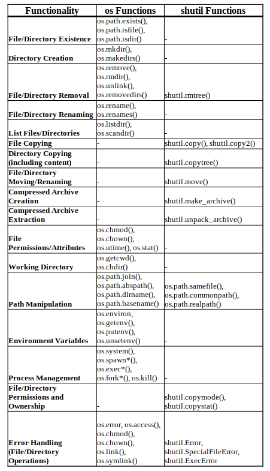

# *Course 401 Python, Entry 19: Automation

**How can you use regular expressions in Python to search for specific patterns in a string, and what is the primary module to work with them?**

The primary Regex module is `re`. Start by `import re`.

## Regex Functions

**match()** - Returns either a match object for a match, or `None` if there is no match. Only works starting from the beginning of the string.

**search()** - Returns the an input sequence for a match at any point in a string and returns a match object.

**findall()** - Finds all possible matches in sequence, returns as a list of strings.

**finditer()** - Returns more detailed location of matches, as an object.

---

**group()** - Selects out of the output match list some said element.

**sub()** - Finds and replaces according to a pattern. Takes replacement as second parameter.

**subn()** - Similar to sub(), but returns a tuple of replaced items.

## Special characters

`.` - Wildcard.

`^` - Matches according to start of the string.

`$` - Matches according to end of the string.

`[abc]` - Matches according to set list of characters. Includes spreads such as `[a-zA-Z0-9]`

---

`[^abc]` - Exclusionary. Matches all not in the set.

`\s` - Space.

`\w` - Any single character, digit, or underscore.

`\W` - Matches any character not included under `\w`.

---

`\s` - Whitespace characters: space, newline, tab, return.

`\S` - Anything not `\s`.

`\d` - Digitis 0-9.

`\D` - Anything not `\d`

---

`\t` - Tab.

`\n` - Newline.

`\r` - Return.

`\b` - Beginning or ending of word.

---

`+` - Repeats.

`*` - Greedy. Zero or more times of occurence.

`?`  - Zero or one occurence.

`*?` - Limited greedy, until next defined character.

---

`{x}` - Repeats X number of times.

`{x,}` - Repeats X number of times or more.

`{x, y}` - Repeats between X through Y times.

`()` - Defines a grouping.

**What is the purpose of the shutil module in Python, and provide an example of a common use case for file or directory management with this module?**

Shutil is used for copying and archiving.

- Find a file via which().
- It can be used to copy file metadata.
  - File permissions, copymode().
  - Other metadata, copystat().
- Shutil can also be used to copy a directory via copytree().

- For file system management, information can be pulled up via disk_usage().

**Compare and contrast the os and shutil modules. When would you choose to use one over the other?**

The comparison for os an shutil simplifies down to os being used for simpler low-level operations, while shutil is for high-level more complex operations.

## Things I want to know more about

Word from experience of when to use os vs shutil.
