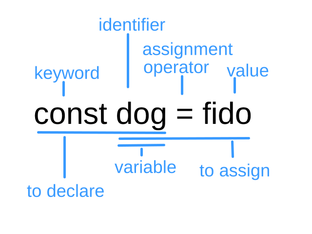

# *Course 102, Entry 6: Dynamic web pages with JavaScript*

## JavaScript

At its inception, JavaScript was made for use in web browsers. It allows allows for dynamic content to be created within a website. This would be considered "client-side" running. Nowadays, JavaScript runs on servers also. The most popular version of these server languages is Node.js.

JavaScript can be included within the HTML file of a website, or it can be within an external JavaScript file, which is then imported with the following line of code. Examples of both are below.

### Internal

```
<script>
     alert("Hello World");
</script>
```

### External

Code within HTML file:

```
<script src="script.js"></script>
```

Code in an external file:

```
alert("Hello World");
```

## Variables

To store information, a **variable** must be used. When making a variable, this is called **declaring**. The two **keywords** that can be used to declare a variable are `let` and `const`. The `let` option is modifiable, and `const` is unchangeable. To declare, a unique name must be given. This is the **identifier**. But declaring just makes it known. To give it meaning, a variable must be **assigned** to some **value**. This is done using the **assignment operator**, `=`. Here is what this looks like. 




Characters that can be used are numbers, letters, `_`, and `$`. Reserved JavaScript words can not be used. Note, letters are case-sensitive. 

Text is known as a **string**. If numbers and strings are added on the right side of an assignment, the system has no choice but to make the sum a string. What would be `9 + porkchop` be otherwise? Note that order of operations applies. Logically, `3 + 3 + porkchop` would be `6 porkchop`.

## Notable Examples

Among the examples to be mentioned, there are three major ways in which JavaScript interacts with the user's computer. One is through the browser console. Normally this can not be seen unless the user right-clicks the screen and selects "Inspect". From here, outputs can be seen in the "console" tab.

The second is by pop-up alert. This pop-up can either just be a notice, it can be a binary choice of "OK" or "Cancel" (thus a kind of Boolean), or it can ask for user input.

The third is by writing to the HTML document.

### Console

#### console.log 

The following is an example of code which will write a determined message to the console. In this case, `Hello world.`

```
console.log("Hello world.")
```

### document.write

With `document.write`, code can be pulled into an HTML document. By adding other lines of JavaScript code to obtain user input in conjunction with `document.write`, the web page can differ depending on the input, thus making a web page dynamic. Note, `document.write` is not just limited to text. It can also write HTML code. Thus, any aspect of a page can change depending on user input.

The following example writes the bolded text, "Hello world."

```
document.write("<b>Hello world.</b>");
```

### Pop-up Alerts

#### alert

To pop up a window in which the user hits "OK" to continue, the following code can be used. The message in this example is "Only US citizens can enter."

```
alert("Only US citizens can enter.")
```

#### confirm

Similar to "alert", this is a notice pop-up which now has two options. The user can either hit "OK", in which case they will be directed to one path (dependent on what is coded next), or the user can select "Cancel", in which they will be directed to another, different path.

Here in this example, the confirm command with `document.write` has been combined. If "OK" is selected, the user gets a picture of an ice cream cone and the text, "An ice cream cone, for you." If the user selects "Cancel", the page will show an ice cream cone on the ground with the text "I'm so sad you didn't want this." Some "if, else" syntax has also been added to allow for this dynamic output. Without some code such as this, the confirm function wouldn't be useful. Also notice, using quotation marks needs to be done carefully. In this example, to avoid syntax conflicts, apostrophes were used and no contractions were used.

```
if (confirm("Can I get you some ice cream?")) {
     document.write('<h1>An ice cream cone, for you.</h1><br>');
} else {
     document.write('<h1>I am so sad you did not want this.</h1><br>');
}
```

#### Prompt

Prompt is the way in which user input can be received via a pop-up. In order to use this input information, it must be stored as a variable.

In the following example, the user's favorite flavor of ice cream is saved as a constant variable. This is done by assigning the identifier `favorite_ice_cream` to the user's favorite ice cream, using the keyword `const`. The written response to the page is indiscriminate.

```
const favorite_ice_cream = prompt("What is your favorite flavor of ice cream?")
document.write(favorite_ice_cream + ". That's a good one.")
```

Similarly, a prompt can be given based on prior data. In this example, the user is asked to come up with a punny ice cream name using the current US president's name. The president's name being prior data. This is done by separating the data to be edited from the prompt question, via a comma. Likewise, the computer's response is indiscriminate here.

```
const presidental_ice_cream = prompt("How about a punny name for President Biden's ice cream?", "Joe Biden");
document.write(presidental_ice_cream + ". Hahah. That's funny.")
```

## Input Dependent Output

Using stored variables, another option is to respond to a previous response, such as the prior question of favorite ice cream, and asking for an update or another flavor. Here is how that would look. To do so, we need to use some if statements, combined with potential responses. Thus, if a response is equal to a coded option (equal being coded by using `==`), the subsequent code runs. Otherwise, the user is asked to try again. This example does not have a loop feature. Therefore, there are only two user input runs. Note, one if-tree must be concluded before assigning a new constant.

```
const favorite_ice_cream = prompt("What is your favorite flavor of ice cream?");

if (favorite_ice_cream == "vanilla"){
    document.write("Ah, " + favorite_ice_cream + ". I know that flavor.");
} else if (favorite_ice_cream == "chocolate"){
    document.write("Ah, " + favorite_ice_cream + ". I know that flavor.");
} else if (favorite_ice_cream == "caramel"){
    document.write("Ah, " + favorite_ice_cream + ". I know that flavor.");
} else {
    const favorite_ice_cream2 = prompt("Are you sure you wrote that correctly? Or perhaps there are any other flavors that you like?", favorite_ice_cream);
    if (favorite_ice_cream2 == "vanilla"){
        document.write("Ah, " + favorite_ice_cream2 + ". I know that flavor.");
    } else if (favorite_ice_cream2 == "chocolate"){
        document.write("Ah, " + favorite_ice_cream2 + ". I know that flavor.");
    } else if (favorite_ice_cream == "caramel"){
        document.write("Ah, " + favorite_ice_cream2 + ". I know that flavor.");
    } else 
        document.write("You said " + favorite_ice_cream2 + "? I don't know that flavor. Hahah.");
};
```