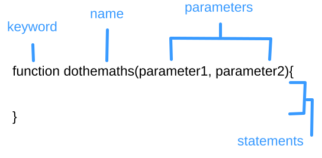

# *Course 102, Entry 7: Programming with JavaScript*

## Control Flow

**Control Flow** is the the order of which code is execuded. A computer's flow starts off as being from top to bottom, but will change what is read and where if it comes accross specific comands. This happens a lot.

A simple example of a switch would be in an if-else (conditional statement). Once the first line of the conditional is met, the next options are irrelevant. Thus, the computer can skip the following lines in the conditional statement and move on. 

## JavaScript Functions

### Components of a Function Definition

In JavaScript, a **function** is a block of code that is set to run certain, **localized** (within the the block) code **statements**.

Calling a function, or **invoking** it, is to execute a function.

A function is composed of the **keyword**, the **name** of the function, the **parameters** with paranthesis (dependent on the function workings), separarted by commas, and the then the lines of code with in curley brackets. 

Functions like other code can also be assigned to variables.



Another important part of a function is the **return** statement. The return statement is written within the code curley brackets; It is what allows code to exit the function and continue on elsewhere.

### Componenets of a Call Function Comand

If the function is to be invoked, the function must be typed out followed by open and closed parenthesis. The open and closed parenthisis together are known as the **operator**. Without the operator, one is just calling the object. If the function by definition has parameter components, then **values** need to be fed into the function. Once the values enter the function into the lines of code, these values are then known as **arguments**. The discerning differenece between parameters and arguments, is that parameters are in the function definintion, while arguments are when the function is being called.

Functions have a lot of neat uses. And while the aren't mandatory to execute code, they make it a whole lot easier and useful. The key advantage of computers is their speed. To truly utilize this puts one light years ahead.

## JavaScript Operators

### Arithmetic Operators

    Operator	Description
	    +	Addition
    	-	Subtraction
	    *	Multiplication
	    **	Exponentiation (ES2016)
	    /	Division
	    %	Modulus (Division Remainder)
	    ++	Increment
	    --	Decrement

### Assignment Operators
    Operator	Example	    Same As
        =		x = y	    x = y
        +=		x += y	    x = x + y
        -=		x -= y	    x = x - y
        *=		x *= y	    x = x * y
        /=		x /= y	    x = x / y
        %=		x %= y	    x = x % y
        **=		x **= y	    x = x ** y

### Comparison Operators
    Operator	Description
        ==	    equal to
        ===	    equal value and equal type
        !=	    not equal
        !==	    not equal value or not equal type
        >	    greater than
        <	    less than
        >=	    greater than or equal to
        <=	    less than or equal to
        ?	    ternary operator

### Logical Operators
    Operator	Description
        &&	    logical and
        ||	    logical or
        !	    logical not

### Type Operators
    Operator	    Description
    typeof		    Returns the type of a variable
    instanceof	    Returns true if an object is an instance of an object type

### Bitwise Operators
    Operator	Description			    Example		Same as			Result	Decimal
    &		    AND						5 & 1		0101 & 0001		0001	 1
    |		    OR						5 | 1		0101 | 0001		0101	 5
    ~		    NOT						~ 5	 		~0101			1010	 10
    ^		    XOR						5 ^ 1		0101 ^ 0001		0100	 4
    <<		    left shift				5 << 1		0101 << 1		1010	 10
    >>		    right shift				5 >> 1		0101 >> 1		0010	  2
    >>>		    unsigned right shift	5 >>> 1		0101 >>> 1		0010	  2

#### Bitwise Operators Explained

    Operator	    Name	                Description
            &	    AND		                Sets each bit to 1 if both bits are 1
            |	    OR		                Sets each bit to 1 if one of two bits is 1
            ^	    XOR		                Sets each bit to 1 if only one of two bits is 1
            ~	    NOT		                Inverts all the bits
            <<	    Zero fill left shift	Shifts left by pushing zeros in from the right and let the leftmost bits fall off
            >>	    Signed right shift	    Shifts right by pushing copies of the leftmost bit in from the left, and let the rightmost bits fall off
            >>>	    Zero fill right shift	Shifts right by pushing zeros in from the left, and let the rightmost bits fall off


See [W2 Schools](https://www.w3schools.com/js/js_bitwise.asp) for a more detailed explanation. 

### String Operators
    Operator	Example					Output Result
    +			text1 = "big" + "deal"	big deal
    +=			text1 = "no"
                text1 += "problem"		no problem

### Ternary Operators
    Syntax:
    condition ? val1 : val2

    If condition is True - val1
    If condition is False - val2

### Comma Operator
The comma operator is a rare one to use. But it can be usful when trying to run a loop with multiple variables at the same time. Don't use this otherwise, as two seperate statements normally can be used.

Example: 

```
const x = [0, 1, 2, 3, 4, 5, 6, 7, 8, 9];
const a = [x, x, x, x, x];

for (let i = 0, j = 9; i <= j; i++, j--) {
  //                              ^
  console.log(`a[${i}][${j}]= ${a[i][j]}`);
}
```

### Unary Operators
An operation with just one operand.

### Other Operators

Some other operators to be used later are `delete`, `void`, `in`, `this` `new`, and `super`.

